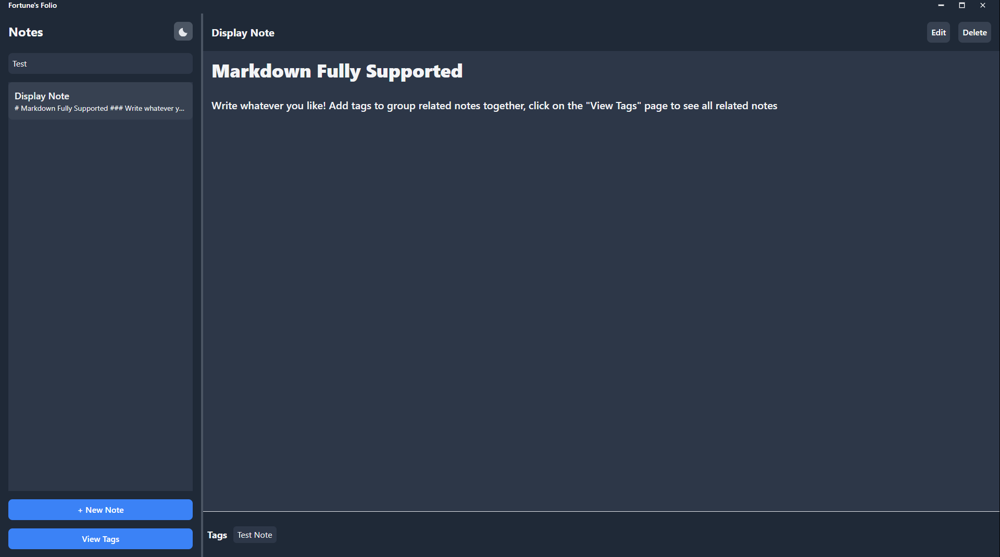

# Fortune's Folio
**Minimalist note-taking.**

## Features
- **Markdown Support:** Write and format notes effortlessly using Markdown.
- **Dark Mode:** Toggle light and dark modes with a single click. 
- **Tags System:** Organize notes with tags for quick and easy filtering.
- **Tag Management:** View all tags on the "View Tags" page and see notes associated with any tag. Click a note to jump to it.
- **Tag Search:** Filter notes dynamically by searching for specific tags.
- **Keyboard Shortcuts:** Perform all operations quickly with intuitive keybinds.
- **Portable and Lightweight:** A single `.exe` file (~6 MB), with no installation required.
- **Undo Deletion:** Recover the last deleted note until the app is closed.
- **Sidebar Resizing:** Drag the gray line on the Notes sidebar to resize to preference.

## Installation

1. Click on the **Releases** tab on the right-hand side of this GitHub repository.
2. Follow installation steps for your OS

### Keyboard Shortcuts
- **`CTRL + N`**: Create a new note.
- **`CTRL + D`**: Delete the current note.
- **`CTRL + S`**: Save the current note.
- **`CTRL + E`**: Edit the current note.
- **`CTRL + F`**: Toggle fullscreen mode.
- **`CTRL + M`**: Minimize the app.
- **`CTRL + U`**: Undo the last note deletion.

### Why Choose Fortune's Folio?
- **Minimalist Design:** The App is intuitive and easy to navigate.
- **Portable:** Carry your notes anywhere with a single `.exe` and `.db` file.
- **Speed and Efficiency:** Optimized for performance, even on low-spec systems.
- **No Clutter:** No installation process, no background processes—just run and write.